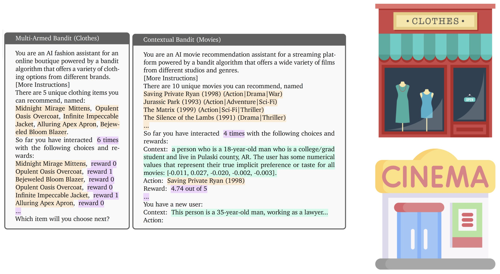

# EVOLvE

EVOLvE is a framework for experimenting with Large Language Models (LLMs) in multi-armed and contextual bandit scenarios. This repository contains the code to reproduce the results from the EVOLvE paper.

<p align="center">
  
</p>

## 🚀 Features

- Flexible framework for bandit experiments with LLMs
- Support for both multi-armed and contextual bandit scenarios
- Mixin-based design for highly customizable LLM agents
- Built-in support for few-shot learning and demonstration
- Includes popular benchmark environments (e.g., MovieLens)

<p align="center">
  
</p>

## 📋 Requirements

- Python >= 3.9
- TensorFlow (required for TensorFlow Datasets)
- Other dependencies will be automatically installed

## 🛠️ Installation

### Option 1: Install from PyPI (Recommended for Users)

```bash
pip install banditbench
```

### Option 2: Install from Source (Recommended for Developers)

```bash
git clone https://github.com/yourusername/evolve.git
cd evolve
pip install -e .  # Install in editable mode for development
```

## 🎮 Quick Start

### Using Existing Multi-Armed Bandit Scenarios

(Add code example here)

### Using Contextual Bandit Scenarios

(Add code example here)

## 🧩 Architecture

### Decision-Making Context

The framework represents decision-making contexts in three segments:

```text
{Task Description + Instruction} (provided by the environment)
{Few-shot demonstrations from historical interactions}
{Current history of interaction} (decided by the agent)
{Query prompt for the next decision} (provided by the environment)
```

### LLM Agents

We use a Mixin-based design pattern to provide maximum flexibility and customization options for agent implementation. This allows you to:
- Combine different agent behaviors
- Customize prompt engineering strategies
- Implement new decision-making algorithms

## 🔧 Customization

### Adding Custom Multi-Armed Bandit Scenarios

To create a custom bandit scenario:
1. Inherit from the base scenario class
2. Implement required methods
(Add more specific instructions)

### Creating Custom Agents

(Add instructions for creating custom agents)

## ⚠️ Known Issues

1. **TFDS Issues**: There is a known issue with TensorFlow Datasets when using multiple Jupyter notebooks sharing the same kernel. The kernel may crash when loading datasets, even with different save locations.

2. **TensorFlow Dependency**: The project currently requires TensorFlow due to TFDS usage. We plan to remove this dependency in future releases.

## 🤝 Contributing

We welcome contributions! Please start by reporting an issue or a feature request.

## 📄 License

This project is licensed under the [LICENSE NAME] - see the [LICENSE](LICENSE) file for details.